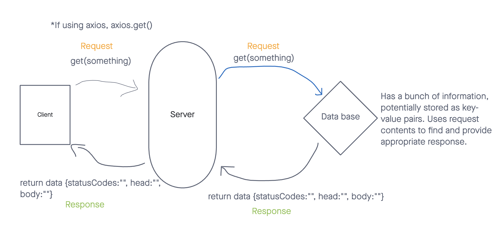

# City Explorer

**Author**: Joseph Streifel
**Version**: 1.1.0 (increment the patch/fix version number if you make more commits past your first submission)

## Overview

This app will be used to provide a user with details about a location, based upon search results. Search will be powered by external API requests.

## Getting Started

This app is built using React Bootstrap and Axios. Ensure all dependencies are installed by running `npm i` upon cloning project.

* Environment Variables: See .env.sample for .env requirements. App will need API access key from location IQ, as well as address for supporting back-end server.

## Architecture

* Libraries used:
  * React
  * React Bootstrap
  * npm axios
  * node.js

Application uses React Bootstrap to setup simple form for text input. Search term from user is fed to [Location IQ API](https://locationiq.com/) to return a City, Latitude, Longitude, and map of resulting location.

Developed in VSCode and deployed using Node.js. Hosted on Netlify.

Upon request, location data is returned from locationIQ and stored in the following format:

```js
location:{
  display_name: "City, County, State, Country"
  lat: "degrees"
  lon: "degrees"

}
```

## Change Log

11/01 10:07pm - Application launched in operating state. Accepts search parameter and returns top result and associated map.
11/02 08:50pm - Weather data retrieval implemented in application. Tied to node.js server backend.
11-03-21 08:54 PM - Movie data retrieval from backend successful on user submit.
11-03-21 10:52 PM - Updates Weather display to look nicer and adds icons.


## Credit and Collaborations

Collaborated with [Brannon Starnes](https://github.com/brannonstarnes) for WRRC sketch and application planning
Location Data and Map received from [Location IQ API](https://locationiq.com/)

## WRRC Breakdown



For this project, my WRRC will be utilizing axios to reach out to a server and request data based on a user input string:

1. User submits string in search box
2. Application creates URL for data request and send it to Location IQ to retrieve location data
3. Location IQ sends response, which is displayed on screen.
4. Latitude and Longitude from response are used to create image URL for map.
5. Map image src is set to new URL, displaying map of area result from user search.

## Feature implementation tracking

### 11-01-2021

* **Name of feature:** Set up React repo & API keys
* Estimate of time needed to complete: 1 hour
* Start time: 4:09 PM
* Finish time: 4:55PM
* Actual time needed to complete: 46 minutes

* **Name of feature:** Locations - search for city by name
* Estimate of time needed to complete: 0.75 hours
* Start time: 5:06 PM
* Finish time: 6:22 PM
* Actual time needed to complete: 1 hour 16 minutes

* **Name of feature:** Map - display map based on name of city
* Estimate of time needed to complete: 1.5 hour
* Start time: 7:10 PM
* Finish time: 9:26 PM
* Actual time needed to complete: 2 hours 16 minutes

* **Name of feature:** Errors - handle errors and display error messages
* Estimate of time needed to complete: 1 hour
* Start time: 9:27 PM
* Finish time: 10:05 PM
* Actual time needed to complete: 38 minutes

* **Name of feature:** Movie Data - Render to page upon retrieval
* Estimate of time needed to complete: 1 hour
* Start time: 08:24 PM
* Finish time: 10:02 PM
* Actual time needed to complete: 0
