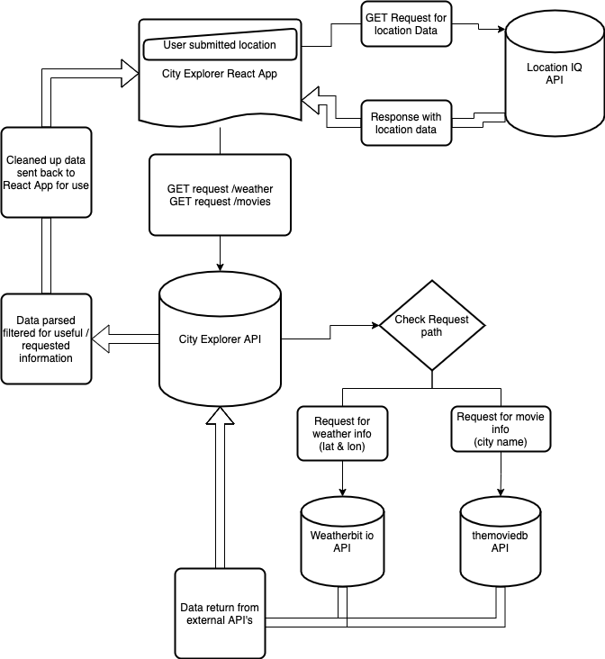

# City Explorer

**Author**: Joseph Streifel
**Version**: 1.1.0 (increment the patch/fix version number if you make more commits past your first submission)

## Overview

This app will be used to provide a user with details about a location, based upon search results. Search will be powered by external API requests.

## Getting Started

This app is built using React Bootstrap and Axios. Ensure all dependencies are installed by running `npm i` upon cloning project.

* Environment Variables: See .env.sample for .env requirements. App will need API access key from location IQ, as well as address for supporting back-end server.

## Architecture

* Libraries used:
  * React
  * React Bootstrap
  * npm axios
  * node.js

Application uses React Bootstrap to setup simple form for text input. Search term from user is fed to [Location IQ API](https://locationiq.com/) to return a City, Latitude, Longitude, and map of resulting location.

Developed in VSCode and deployed using Node.js. Hosted on Netlify.

Upon request, location data is returned from locationIQ and stored in the following format:

```js
location:{
  display_name: "City, County, State, Country"
  lat: "degrees"
  lon: "degrees"
}
```

## Change Log

11/01 10:07pm - Application launched in operating state. Accepts search parameter and returns top result and associated map.
11/02 08:50pm - Weather data retrieval implemented in application. Tied to node.js server backend.
11-03-21 08:54 PM - Movie data retrieval from backend successful on user submit.
11-03-21 10:52 PM - Updates Weather display to look nicer and adds icons.


## Credit and Collaborations

Collaborated with [Brannon Starnes](https://github.com/brannonstarnes) for WRRC sketch and application planning
Location Data and Map received from [Location IQ API](https://locationiq.com/)
Weather Data and Icons provided by [Weatherbit.io API]()
Movie data and posters provided by [themoviedb.org API]()

## WRRC Breakdown

### 11-01


For this project, my WRRC will be utilizing axios to reach out to a server and request data based on a user input string:

1. User submits string in search box
2. Application creates URL for data request and send it to Location IQ to retrieve location data
3. Location IQ sends response, which is displayed on screen.
4. Latitude and Longitude from response are used to create image URL for map.
5. Map image src is set to new URL, displaying map of area result from user search.

### 11-04



Our WRRC is getting a bit more complex. Our netlify app makes a request to an API that we've hosted on Heroku. That API looks at the path of the request, and forwards parameters accordingly to either TMDB API or WeatherBit.io API. The pinged API returns a response object, from which the heroku API grabs the data. The heroku API then cleans up the data and sends it back to our Netlify app, completing this WRRC.

## Feature implementation tracking

| Feature # | Feature Name | Estimated Time | Start Time | End Time | Total Time |
|-----------|--------------|----------------|------------|----------|------------|
| 1 | Set up React repo & API keys | 01:00 | 04:09 PM | 04:55 PM | 00:46 |
| 2 | Locations - search city by name | 00:45 | 05:06 PM | 06:22 PM | 01:16 |
| 3 | Map - display map based on search | 01:30 | 07:10 PM | 09:26 PM | 02:16 |
| 4 | Errors - handle/display errors | 01:00 | 09:27 PM | 10:05 PM | 00:38 |
| 5 | Movie Data - Render to page | 01:00 | 08:24 PM | 10:02 PM | 01:38 |
| 6 | Refactor - Componentize | 01:30 | 4:32 PM | 06:44 PM | 02:12 |

